<link href="style.css" rel="stylesheet"></link>

# Sandcastle Smart Contract Tutorial

The following steps lead a user who knows only SQL to write Ethereum smart contracts which they can they deploy and interact. This tutorial uses a Sandcastle web service as a Remix plugin. 

Some insights into the reasoning behind our bridging of Ethereum and database technologies can be found in the following articles. 

<a href="https://media.consensys.net/blockchains-and-databases-arent-the-same-thing-yet-5d5eb7df099e" target="new">Blockchains and Databases Aren’t the Same Thing. Yet.</a> 

<a href="https://pegasys.tech/sandcastle-brings-sql-to-ethereum-smart-contracts/" target="new">Sandcastle brings SQL to Ethereum Smart Contracts.</a> 

# Setup

Go to <http://3.95.3.208:8080/#optimize=false&version=soljson-v0.5.2+commit.1df8f40c.js>, ignore any messages that Remix shows by clicking OK on them.
Then navigate to the `Settings` panel that appears as a tab on the right side of the Remix web page.

<!-- Note: remix.ethereum.org provides a newer plugin api than is currently supported by the Sandcastle Remix plugin. -->
<!-- Go to <http://remix.ethereum.org/#optimize=false&version=soljson-v0.5.2+commit.1df8f40c.js>, then navigate to the `Settings` panel (on the right side of the Remix web page). -->
<!--
Instead, download and launch an earlier release: https://github.com/ethereum/remix-ide/releases/tag/v0.7.7
-->

Copy the following Sandcastle plugin definition into the text area, then press `Load` to add the Sandcastle plugin button.

    {
      "title": "Sandcastle",
      "url": "http://3.95.3.208:4567"
    }

This is what it looks like.

<figure>
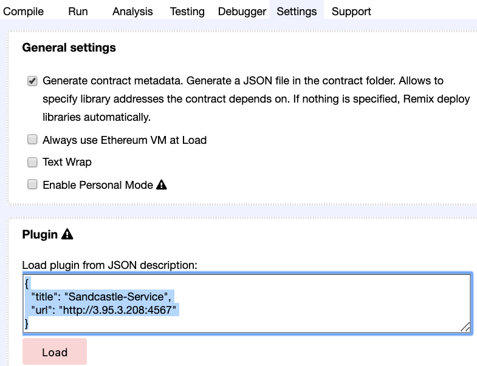
<figcaption>Figure: Load Sandcastle plugin.</figcaption>
</figure>

Pressing the new button will show the Sandcastle panel.

<figure>
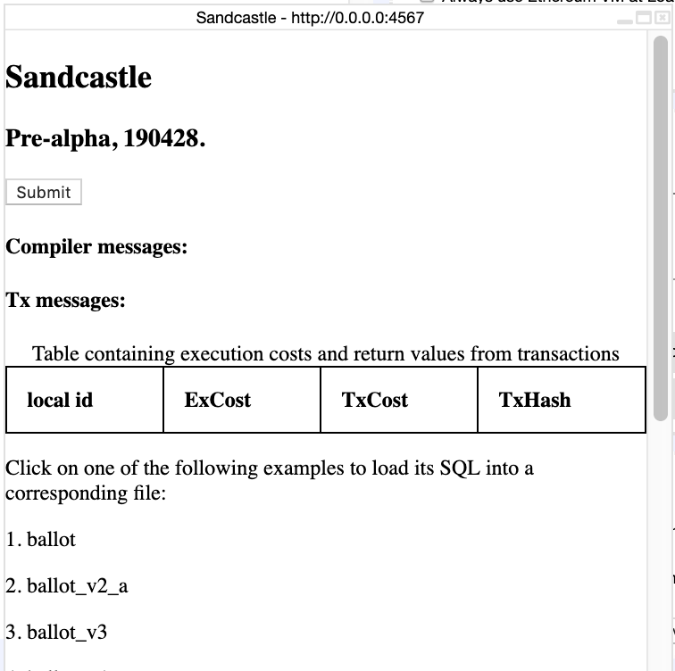
<figcaption>Figure: Sandcastle Remix plugin panel.</figcaption>
</figure>

# Load an example smart contract

Press on one of the example smart contracts in the panel, for example, pick 'selects'.

A file should appear in the left panel named 'selects.sql'. Clicking on the file will show content like the following.

<figure>
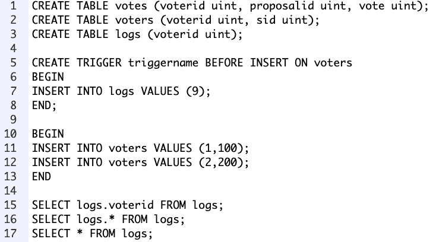
<figcaption>Figure: Example Sandcastle SQL smart contract.</figcaption>
</figure>

# Compile a smart contract

In order to use the Sandcastle web service to translate SQL into Solidity, click on the 'Submit' button at the top of the panel. The button send the SQL code of the currently selected file, and generates a corresponding file with the added extension '.sol'. Successfully generating an output file will have a Compiler message as follows.

<figure>
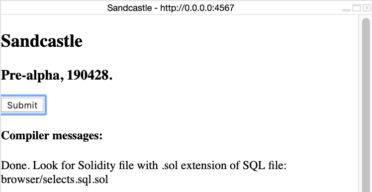
<figcaption>Figure: Compilation message.</figcaption>
</figure>

Click on the newly generated file (which should have appeared to the left). For this example, the code looks as follows.
When Solidity source is viewed, the panel reacts to compilation results (including automatic compilation) with red (error) or green (success).

<figure>
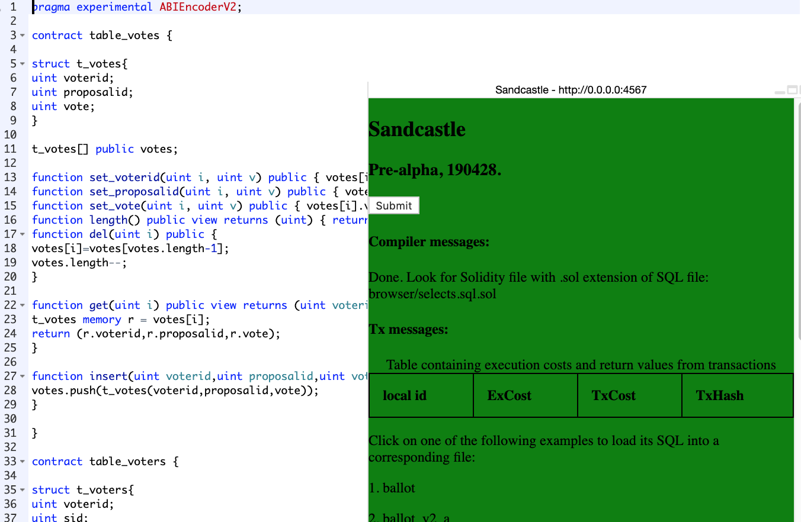
<figcaption>Figure: Compilation result.</figcaption>
</figure>

# Deploy a smart contract

A Sandcastle smart contract is deployed like other smart contracts in Remix. 

After compiling a Solidity smart contract, navigate to the 'Run' tab. Ensure that the `body` smart contract is selected, then click on deploy. If a Sandcastle smart contract does not deploy successfully, try increasing the gas limit. 

<figure>
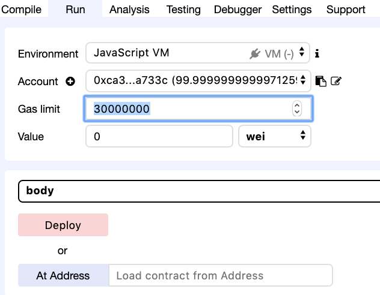
<figcaption>Figure: Remix deployment panel and gas panel.</figcaption>
</figure>

# Sandcastle smart contract functions

The following figure shows the functions defined on the selects example smart contract.

<figure>
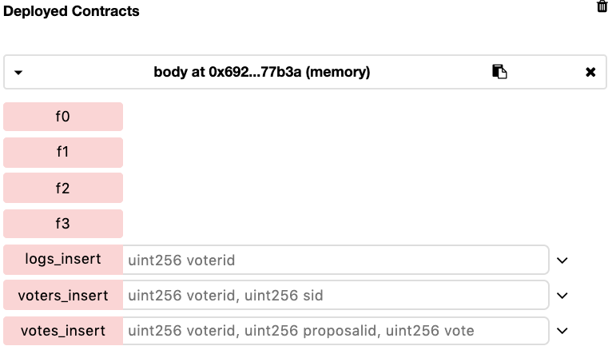
<figcaption>Figure: Example smart contract functions.</figcaption>
</figure>

<figure>

<figcaption>Figure: Example smart contract.</figcaption>
</figure>

Transactions occurring as a result of 'BEGIN' and 'END' do not take parameters, and are functions name with `f` and a number incrementally starting from `0`, e.g., `f0`. The functions are defined sequentially in the same order as in the SQL file. An improved naming convention will be provided soon. In the case of the `selects` example, `f0` coincides with the `INSERT` statements on lines 10-13. The functions `f1`, `f2`, and `f3` implement the select statements on lines 15, 16, and 17, respectively.  

Convenience methods are also defined to allow inserting a row into each of the table schemas defined.

# Interacting with a Sandcastle smart contract

Let's execute the sequence of transactions defined for the `select` example.

Click on `f0` to execute. The panel and the Remix output console should update with a successful transaction as follows.

<figure>
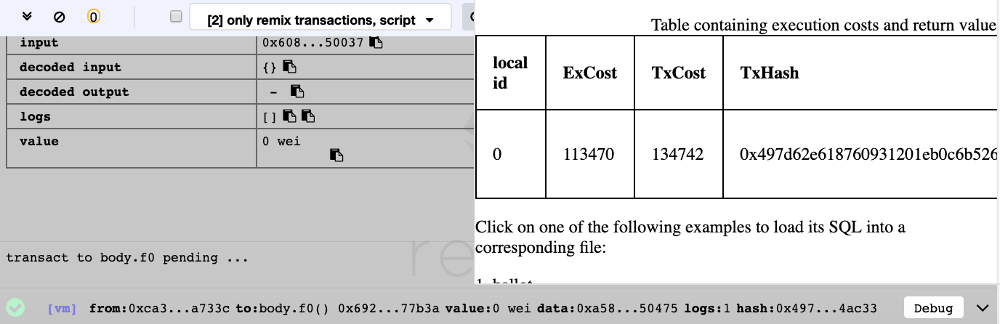
<figcaption>Figure: f0 execution.</figcaption>
</figure>

The figure shows that the execution cost is 113470 and the transaction cost is 134742.

Clicking on the transaction in the Remix output console will show the transaction's properties. Notice that the transaction's `logs` contain the SQL expression that was executed.

Now, click on `f1` to execute that method.

<figure>
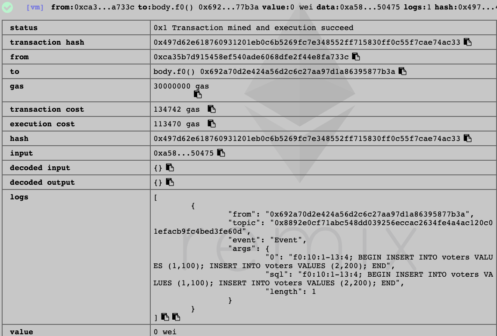
 <figcaption>Figure: f0 execution in Remix console output.</figcaption>
</figure>

The query output is shown in the decoded output property of the mined transaction. In this case, there is an entry `9` in the log table for each insert that was performed.

<figure>
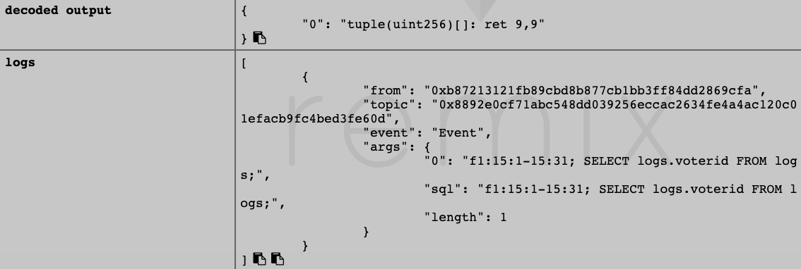
 <figcaption>Figure: Smart contract output of multiple rows (single column).</figcaption>
</figure>

Notice that a query that projects more than one column returns a tuple with multiple elements. The tuple is a sequential array where each row begins at offset `array_index // number_of_columns`.
 
<figure>
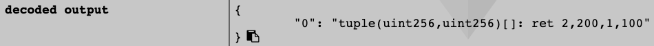
<figcaption>Figure: Smart contract output of multiple columns and rows.</figcaption>
</figure>

 
# Team

Bugs, questions, feature requests, and feedback can be directed to <a href="mailto:shahan.khatchadourian@consensys.net">Shahan Khatchadourian</a>.

[LinkedIn](https://www.linkedin.com/in/shahan-khatchadourian-ph-d-66115210b/)
[Twitter](https://twitter.com/shahankhatch)
